# RasPicoDacFg
16bit R-2R DAC made with RasPico and function generator made with it.

# Setup
* Raspberry Pi Pico
* Orignal Hardware (16bit R-2R Ladder DAC)
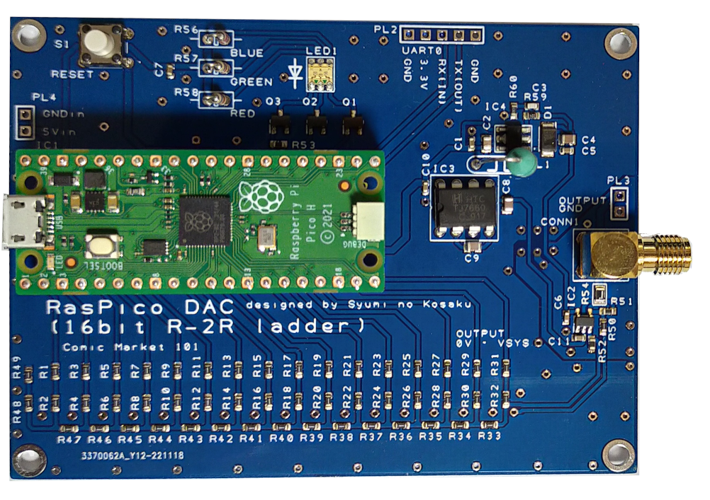  

# DAC spec
* Voltage range: 0 ~ 10 V(typ)
* Voltage accuracy: Depends on 3.3V accuracy (probably around 1.5%)
The DAC output is a little noisy. 
If it bothers you, you can improve it by adding a capacitor to the output.

# Function Generator spec
* Waveform: Sine, Pulse, Triangular, Sawtooth, Ramp
* Frequency: 2 Hz ~ 100 kHz (Only sawtooth wave from 4Hz to 50kHz)
* Frequency accuracy: not so good.(Please check by yourself.) 
* Adjustable settings: Voltage, Number of waveforms, time

# Output wave Sample
DAC out 100mV
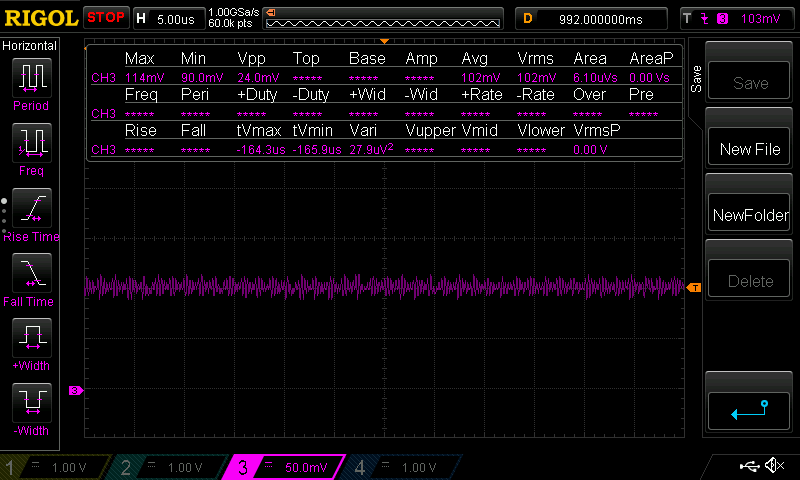

DAC out 5000mV
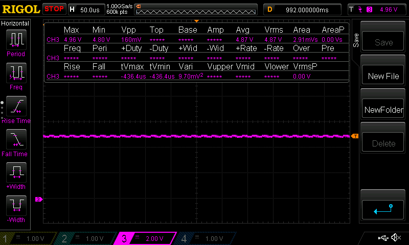

DAC out 10000mV (Max)

Sine Wave (1kHz)
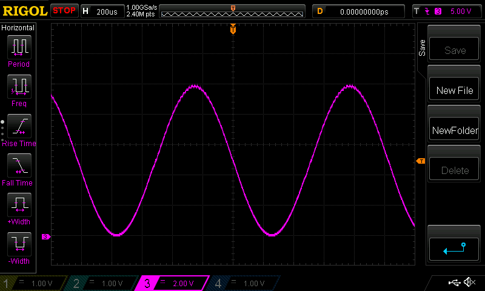

Sine Wave (100kHz)
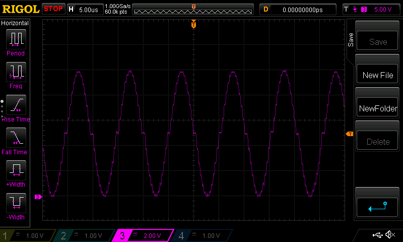

Pulse Wave (1kHz)
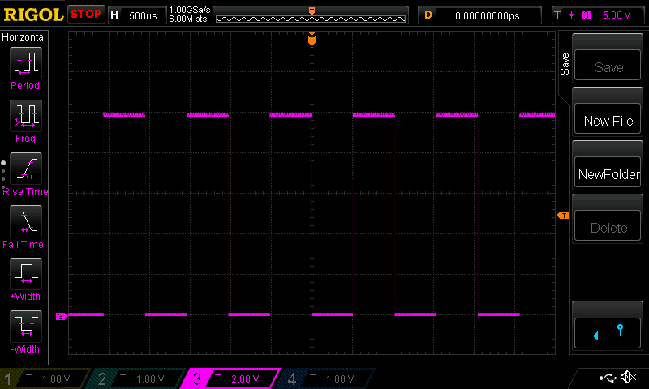

Triangular (1kHz)
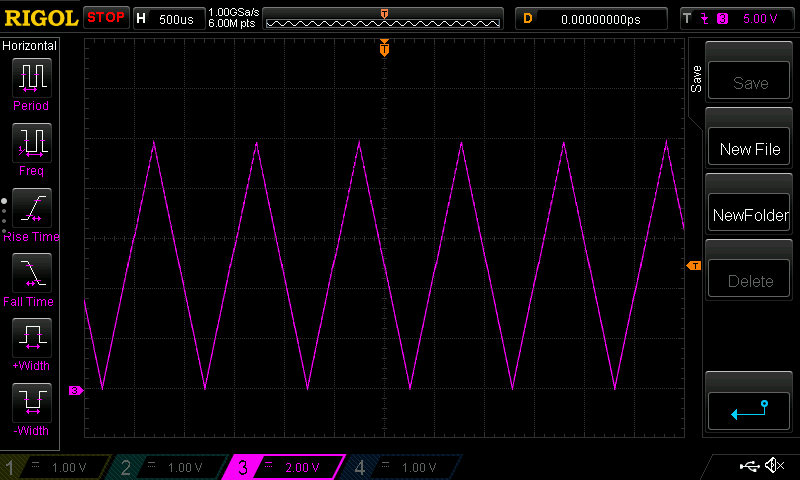

Sawtooth (1kHz)
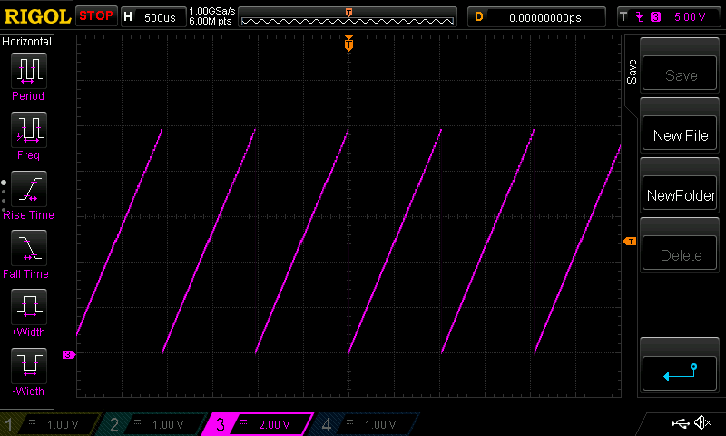

Ramp up (0V 500 ms -> ramp up 1000 ms -> 8V fin)
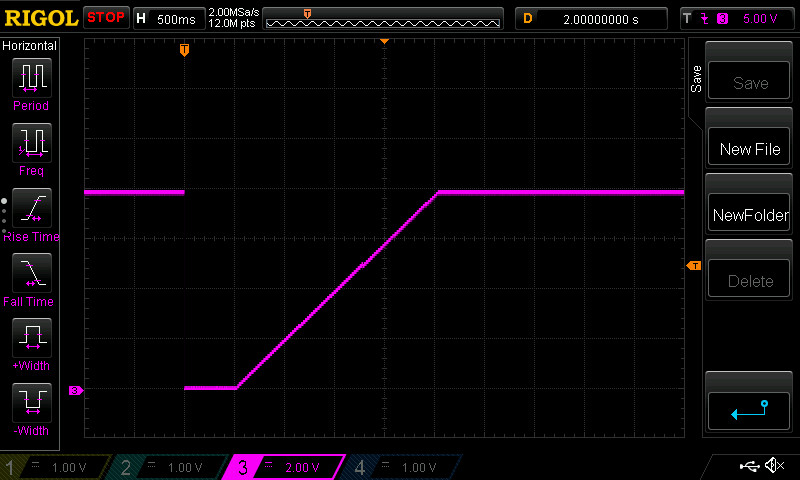

Ramp down (10V 1000 ms -> ramp down 500 ms -> 2V fin)
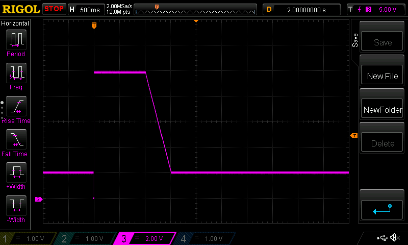

# How to use
* Connect USB cable to Raspberry Pi Pico.
* Open COM port with Serial console.(for example "Tera Term")
* Press Enter (or Send CR)
* Input commands, then "START".
* "STOP" if want to stop output.
See "HELP" command for details.

Serial sample (sine wave)
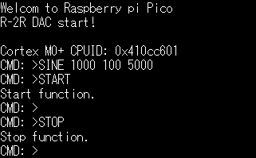

Serial sample (help)
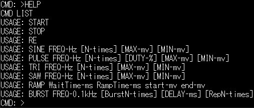

# How to build
Please Google "How to build Raspberry Pi Pico".

# Notes
The output waveform may fluctuate in 1 ms cycles.
It may be improved by communicating via UART instead of USB-CDC.

UART is same pin assign as "Akiduki USB-Serial isolated module".
https://akizukidenshi.com/catalog/g/gK-14652/

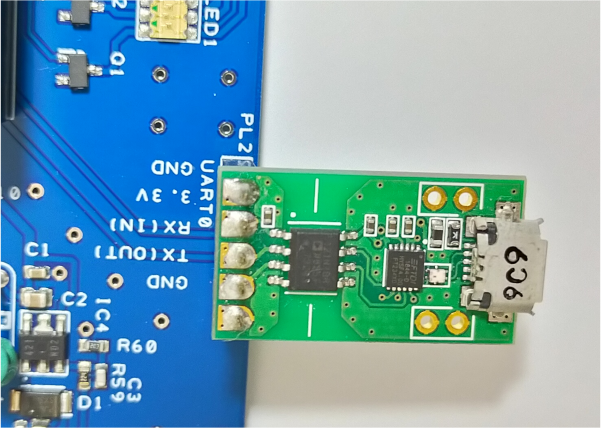  

## License
MIT License.